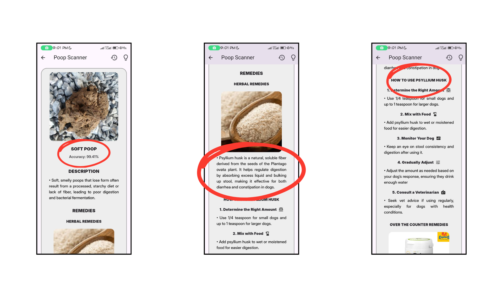

# Dog Stool Classifier

An Android app that classifies dog stool images into 5 health categories using an on-device TFLite model fine-tuned from MobileNetV2. Built with Flutter. Designed for fur parents as a first-line health monitoring tool — snap a photo, get a classification, and see relevant remedies when a vet isn't immediately available.



## Features

- **Image Capture & Upload** — Capture directly in-app or upload from gallery. Flashlight toggle for low-light use.
- **5-Class Classification** — Classifies stool as Normal, Lack of Water, Diarrhea, Soft Poop, or Not a Feces, with a confidence score and health description per result.
- **Remedy Recommendations** — Each result includes herbal and over-the-counter remedies to give owners actionable options while professional care is arranged.
- **Scan History** — Saves past results so owners (and vets) can track patterns over time.

## Classification Classes

| Class | Description |
|-------|-------------|
| Normal | Healthy stool — no immediate concern |
| Lack of Water | Indicates dehydration |
| Diarrhea | Loose or watery stool |
| Soft Poop | Softer than normal, may indicate dietary issues |
| Not a Feces | Input image does not appear to be dog stool |

## Tech Stack

- **App:** Flutter (Android)
- **Model Training:** TensorFlow / Keras
- **On-Device Inference:** TFLite
- **Base Model:** MobileNetV2 (ImageNet pretrained)

## Model

Fine-tuned MobileNetV2 with a custom classification head (GlobalAveragePooling2D → Dropout(0.2) → Dense(5, softmax)).

**Training pipeline:**
- **Phase 1 — Feature extraction:** Base model frozen, head trained with Adam (lr=0.0001), up to 100 epochs, early stopping on val_loss (patience=10).
- **Phase 2 — Fine-tuning:** Layers from index 120 unfrozen, retrained with RMSprop (lr=0.00001), up to 50 additional epochs, same early stopping.

**Data augmentation:** Horizontal/vertical flip, rotation (±40%), zoom (±30%), contrast, brightness, translation, Gaussian noise.

**Dataset:** 1,050 training images · 5 classes · validated on 150+ real-world samples  
**Accuracy:** 92%

The trained model is exported to `.tflite` for fully on-device inference — no network call required at runtime.

## Project Structure

```
├── lib/
│   ├── main.dart                # App entry point
│   ├── hive_helper.dart         # Hive database helper
│   ├── frontpage/
│   │   ├── about_page.dart
│   │   └── frontpage.dart
│   ├── history/
│   │   ├── history_detail_page.dart
│   │   └── history_page.dart
│   ├── insight_content/
│   │   ├── insight_content.dart
│   │   ├── remedy_step_widget.dart
│   │   └── styles.dart
│   └── main/
│       └── tips_dialog.dart
├── assets/
│   ├── x.tflite                 # TFLite model
│   ├── 1.txt                    # Class labels
│   ├── fonts/
│   │   └── Inter-Black.ttf, InterDisplay-Medium.ttf
│   ├── images/
│   │   └── logo, remedy images
│   ├── Training and Finetuning.ipynb
│   └── upload.jpg
├── android/
├── ios/
├── linux/
├── macos/
├── windows/
├── web/
├── test/
│   └── widget_test.dart
├── pubspec.yaml
└── web_entrypoint.dart
```

## Setup

### Prerequisites

- Flutter SDK (stable channel)
- Android Studio or VS Code with Flutter extension
- Android device or emulator (API 21+)

### Installation

1. **Clone the repository**

```bash
git clone <repo-url>
cd dog-stool-classifier
```

2. **Install dependencies**

```bash
flutter pub get
```

3. **Place the TFLite model**

Copy your `model.tflite` file to `assets/model/`. Ensure `pubspec.yaml` includes:

```yaml
flutter:
  assets:
    - assets/model/model.tflite
    - assets/labels.txt
```

4. **Run the app**

```bash
flutter run
```

> **Note:** This app targets Android only. iOS is out of scope for this release.

## Model Training

The training notebook (`Training_and_Finetuning.ipynb`) covers the full pipeline — dataset loading, augmentation, feature extraction phase, fine-tuning phase, evaluation, and TFLite export. See the notebook for details.

## Limitations

- Android only — no iOS support planned at this stage.
- Model accuracy may degrade on images taken in extreme lighting conditions. Use the in-app flashlight for best results in low-light environments.
- This app is a monitoring aid, not a diagnostic tool. Always consult a veterinarian for medical decisions.

## License

MIT — see [LICENSE](LICENSE).
